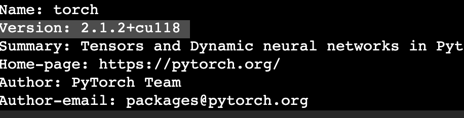

To set up environment:
1. Make sure you have access to at least one GPU. If not, this code will take days to run.
2. Install pandas, matplotlib, numpy==1.26.4, scipy, scikit-learn.
3. If torch is already installed, uninstall it.
4. Now (re)install torch with: '''pip install torch==2.1.2 --index-url https://download.pytorch.org/whl/cu118'''
5. Run '''pip show torch'''

Note the torch version in your terminal output after 'Version: '. It should be something like 2.1.2+cu118
6. Now install: '''pip install torch-scatter torch-sparse -f https://data.pyg.org/whl/torch-{HERE}.html''' where the {HERE} is the version from Step 4 i.e. 2.1.2+cu118.
Ideally, the command should read: '''pip install torch-scatter torch-sparse -f https://data.pyg.org/whl/torch-2.1.2+cu118.html'''
7. Lastly install torch-geometric: '''pip install torch-geometric'''

Make sure the ipynb notebooks are being run in this environment, otherwise you may have to install steps 2-7 on the global environment.

All code is under GC-MERGE/src. Please navigate to this directory as all the paths from here on will be relative to GC-MERGE/src.

Now follow the following steps:
1. Navigate to q1_project/model_eval.ipynb. Run this notebook through. This notebook will run all the models (GAT, GC-MERGE, Weighted GC-MERGE) for all three cell lines. Note that running this notebook through will take 30-40 mins.
2. Now in the same directory q1_project, find figures.ipynb. Run this notebook through. This is generate all the figures in the Q1 report.

All of the code for the models can be found under q1_project/final_model_classes.